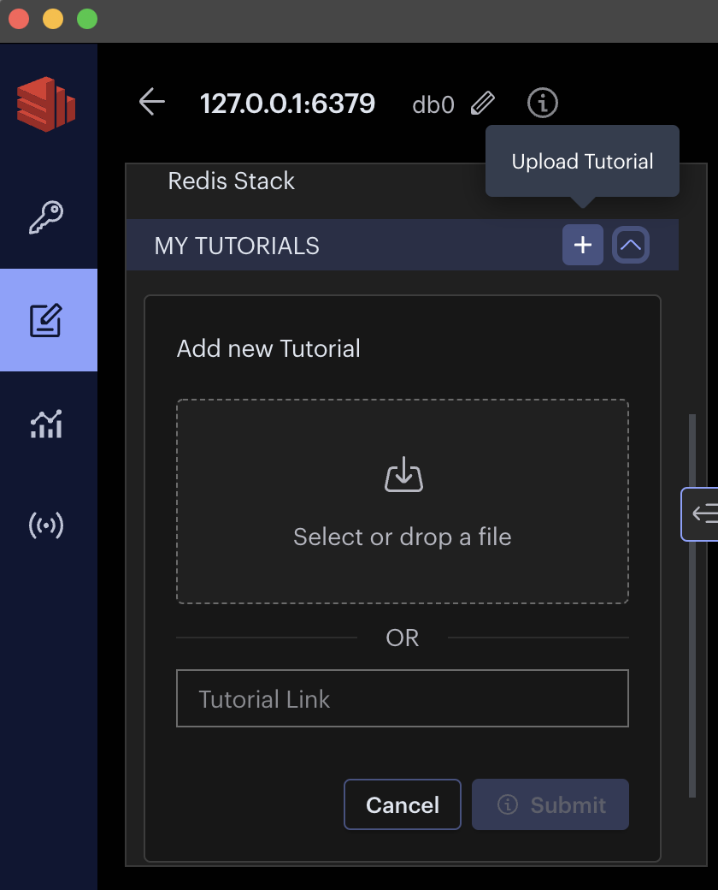

# Open@Microsoft Redis Geoset

This is the publicly available repo containing the tutorial and links for the Open@Microsoft Geoset video.

**Prerequisites**

- Redis Insight
  - https://redis.com/redis-enterprise/redis-insight/

**Steps**

1. Create a zip file of the folder geoset-tutorial.
1. Open Redis Insight and click upload tutorial button.

1. Click *"Select or drop a file"* and upload the zipped file created on Step 1.
1. Click Submit and follow the tutorial.
